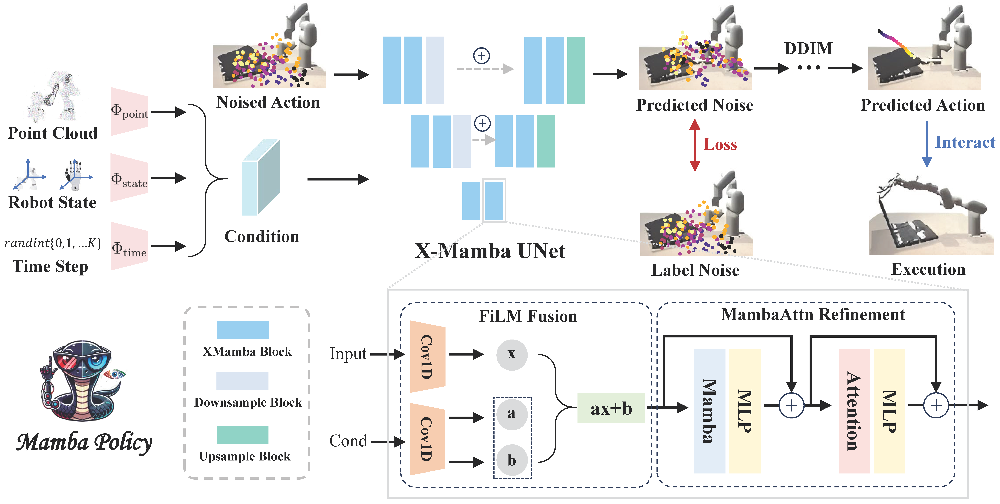

# <a href="https://andycao1125.github.io/mamba_policy/">Mamba Policy</a>

<a href="https://andycao1125.github.io/mamba_policy/"><strong>Project Page</strong></a>
  |
  <a href="https://arxiv.org/pdf/2409.07163"><strong>arXiv</strong></a>
  |

  <a>Jiahang Cao*</a>, 
  <a>Qiang Zhang*</a>, 
  <a>Jingkai Sun</a>, 
  <a>Jiaxu Wang</a>, 
  <a>Hao Cheng</a>, 
  <a>Yulin Li</a>,
  <a>Jun Ma</a>, 
  <a>Yecheng Shao</a>, 
  <a>Wen Zhao</a>, 
  <a>Gang Han</a>, 
  <a>Yijie Guo</a>, 
  <a>Renjing Xu</a>


<!-- <div align="center">
  
</div> -->

**Mamba Policy**, a lighter yet stronger
policy method based on a hybrid state space model
integrated with attention mechanisms. Our extensive experiments demonstrate that Mamba
Policy achieves up to a 5% improvement in success rate
under a variety of manipulation datasets, while reducing
the parameter count by 80%.

**Note**: This repository as well as the following guidelines are based on [3D Diffusion Policy](https://github.com/YanjieZe/3D-Diffusion-Policy), thanks for the authors' open resoure which greatly contributes to the community.


<!-- # 📊 Benchmark of DP3

**Simulation environments.** We provide dexterous manipulation environments and expert policies for `Adroit`, `DexArt`, and `MetaWorld` in this codebase (3+4+50=57 tasks in total). the 3D modality generation (depths and point clouds) has been incorporated for these environments.

**Real-world robot data** is also provided [here](https://drive.google.com/file/d/1G5MP6Nzykku9sDDdzy7tlRqMBnKb253O/view?usp=sharing).


**Algorithms**. We provide the implementation of the following algorithms: 
- DP3: `dp3.yaml`
- Simple DP3: `simple_dp3.yaml`

Among these, `dp3.yaml` is the proposed algorithm in our paper, showing a significant improvement over the baselines. During training, DP3 takes ~10G gpu memory and ~3 hours on an Nvidia A40 gpu, thus it is feasible for most researchers.

`simple_dp3.yaml` is a simplified version of DP3, which is much faster in training (1~2 hour) and inference (**25 FPS**) , without much performance loss, thus it is more recommended for robotics researchers. -->

# 💻 Installation & 📚 Data Preparation

Please carefully follow the guidelines in [3D Diffusion Policy](https://github.com/YanjieZe/3D-Diffusion-Policy) for installation and data generation.

## Step 1: Environment Setup
- See [INSTALL.md](INSTALL.md) for installation instructions: the main setup from DP3. 
- [Option] ```pip install causal-conv1d>=1.4.0```: an efficient implementation of a simple causal Conv1d layer used inside the Mamba block.
- ```pip install mamba-ssm```: the core Mamba package.


## Step 2: Data Generation
You could generate demonstrations by yourself using our provided expert policies.  Generated demonstrations are under `$YOUR_REPO_PATH/3D-Diffusion-Policy/data/`.
- Download Adroit RL experts from [OneDrive](https://1drv.ms/u/s!Ag5QsBIFtRnTlFWqYWtS2wMMPKNX?e=dw8hsS), unzip it, and put the `ckpts` folder under `$YOUR_REPO_PATH/third_party/VRL3/`.
- Download DexArt assets from [Google Drive](https://drive.google.com/file/d/1JdReXZjMaqMO0HkZQ4YMiU2wTdGCgum1/view?usp=sharing) and put the `assets` folder under `$YOUR_REPO_PATH/third_party/dexart-release/`.

**Note**: since you are generating demonstrations by yourselves, the results could be slightly different from the results reported in the paper. This is normal since the results of imitation learning highly depend on the demonstration quality. **Please re-generate demonstrations if you encounter some bad demonstrations** and **no need to open a new issue**.

# 🛠️ Simulation Usage
Scripts for generating demonstrations, training, and evaluation are all provided in the `scripts/` folder. 

The results are logged by `wandb`, so you need to `wandb login` or export your wandb key at ```YOUR_REPO_PATH/Mamba-Policy/3D-Diffusion-Policy/train.py```:
```bash
    import os
    os.environ['WANDB_API_KEY'] = YOUR_WANDB_KEY
``` 

For more detailed arguments, please refer to the scripts and the code. We here provide a simple instruction for using the codebase.

1. Generate demonstrations by `gen_demonstration_adroit.sh` and `gen_demonstration_dexart.sh`. See the scripts for details. For example:
    ```bash
    bash scripts/gen_demonstration_adroit.sh hammer
    ```
    This will generate demonstrations for the `hammer` task in Adroit environment. The data will be saved in `3D-Diffusion-Policy/data/` folder automatically.

    We conducted experiments on `Adroit (Hammer, Door, Pen)`, `DexArt (Laptop Faucet Toilet Bucket)`, and `MetaWorld (Assembly, Disassemble, Stick-Push)` in our paper.

2. Train and evaluate a policy with behavior cloning. For example:
    ```bash
    bash scripts/train_policy.sh dp3_mamba adroit_hammer 1125 0 0
    ```
    This will train a Mamba Policy with mamba-v1 on the `hammer` task in Adroit environment using point cloud modality. 

    ```bash
    bash bash scripts/train_policy_multi.sh dp3_mamba_hydra metaworld_stick-pull 1125 0
    ```
    Or you can train models with 3 seeds (default seeds: [0,1,2]).

**Note**: the eval.sh is only provided for deployment/inference. **For benchmarking, please use the results logged in wandb during training.**


For Mamba Policy with more state-space model (SSM) variants, we also provide their codes for future exploration:
- Mamba-V1: `dp3_mamba.yaml`, which is based on the origin [Mamba](https://arxiv.org/abs/2312.00752).
- Mamba-V2: `dp3_mamba_v2.yaml`, where [Mamba2](https://arxiv.org/abs/2405.21060) is adopted.
- Mamba-Bidirectional: `dp3_mamba_bi.yaml`, where the bidirectional mamba module is introduced in [Vision Mamba](https://github.com/hustvl/Vim/tree/main).
- Mamba-Hydra: `dp3_mamba_hydra.yaml`, a quasiseparable matrix mixer-based bidirectional SSM ([Hydra](https://arxiv.org/pdf/2407.09941)).

**Note**: Since Vision Mamba (Vim) modified the core codes of mamba-ssm, when using `dp3_mamba_bi.yaml`, you should first uninstall the mamba package through ```pip uninstall mamba-ssm```, 
then install the vim-based mamba from github source:
```bash
git clone https://github.com/hustvl/Vim.git
cd Vim
pip install -e causal_conv1d>=1.1.0
pip install -e mamba-1p1p1
```

# 😎 Key Observations in Training
### Training Speed Discrepancy Despite Fewer Parameters
Despite Mamba policy having a significantly smaller parameter count (~80% fewer) compared to DP3, its training speed is not consistently faster. This phenomenon is primarily attributed to Mamba's architectural design, which introduces a substantial constant overhead. This overhead becomes negligible only when the sequence length exceeds a certain threshold. 

As described in the paper, Mamba outperforms CNNs in speed when the sequence length > ~8k, and surpasses Transformers (with Flash Attention) when the sequence length > ~2k. For further details, refer to Figure 8 in the [Mamba](https://arxiv.org/abs/2312.00752) paper.

*Related issues and explanations:*
- https://github.com/state-spaces/mamba/issues/156


### Increased Initial Load and Training Time for Mamba Variants
Variants of Mamba, such as Mamba2 and Hydra, exhibit longer initial load times and extended training durations. This is largely due to the fact that Mamba2 is predominantly implemented in Triton, resulting in significant CPU overhead, especially for smaller layers. Two potential solutions to mitigate this issue include: (1) leveraging CUDA graphs or Torch compilation, and (2) scaling up the model size. 


*Related issues and explanations:*
- https://github.com/state-spaces/mamba/issues/355
- https://github.com/state-spaces/mamba/issues/510
- https://github.com/state-spaces/mamba/issues/657
- https://github.com/goombalab/hydra/issues/9


Therefore, scaling up the Mamba model size (e.g., by extending the sequence length) is a promising approach to reduce overhead and improve efficiency, making it a viable direction for future research.

# 🤖 Real Robot

**TBD**


# 😺 Acknowledgement
Our code is generally built upon: [3D Diffusion Poliy](https://github.com/YanjieZe/3D-Diffusion-Policy), [Diffusion Policy](https://github.com/real-stanford/diffusion_policy), [Mamba](https://github.com/state-spaces/mamba), [Vision Mamba](https://github.com/hustvl/Vim/tree/main), [Hydra](https://github.com/goombalab/hydra). We thank all these authors for their nicely open sourced code and their great contributions to the community.

For any help or issues of this project, please contact [Jiahang Cao](jcao248@connect.hkust-gz.edu.cn).

# 📝 Citation

If you find our work useful, please consider citing:
```
@article{cao2024mamba,
  title={Mamba Policy: Towards Efficient 3D Diffusion Policy with Hybrid Selective State Models},
  author={Cao, Jiahang and Zhang, Qiang and Sun, Jingkai and Wang, Jiaxu and Cheng, Hao and Li, Yulin and Ma, Jun and Shao, Yecheng and Zhao, Wen and Han, Gang and others},
  journal={arXiv preprint arXiv:2409.07163},
  year={2024}
}
```
